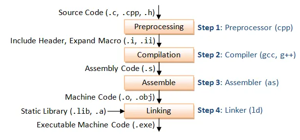

History point on Make:

The version we use today is GNU Make which was released in 1988.
But the Make build system is much older (1976).

It was created to make building C projects a lot faster.
It was created after Steve Johnson spent a lot of time trying to debug why his program wasn't working and it was because he didn't create the .o file correctly.

The promise was to look for .c files that were modified recently and compile their .o and link them.

Taken from https://medium.com/@andreshugueth/steps-of-compilation-in-c-96840f964674
