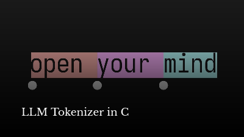

# Source

The original author of this software is [Tsoding](https://github.com/tsoding).

https://github.com/tsoding/bpe

Highly recommand watching this video for your personal culture:

Files modified:
- nob.c was removed
- bpe_gen.c:92 assert was removed (causes for tokens to simply not load on my testing, see https://github.com/tsoding/bpe/issues/3)
- data/full_source.txt which contains all the source code of the program generated with `cat ../**/*{.c,.h} > full_source.txt`

# Get the source code

Get the `bpe.tar.gz` and untar it with:

`tar -xvf bpe.tar.gz`

This will create a bpe folder containing all the source material.

# Goal

In the `bpe` directory, create a Makefile that:
- If no `CC` is specified, build using gcc
- Sets the `CFLAGS` by default to `-Wall -Wextra -Ofast`
- If `ENV` is set to `dev`, add `-ggdb` to the `CFLAGS`
- Set include folder to point to `thirdparty` using the right variable
- Sets an overriden implicit rule to compile from `.c` to `.o` and then echo `file.c built!`
- Build the `txt2bpe`, `bpe_inspect` and `bpe_gen` binaries
- Force the `bpe_inspect` rule to use `clang` as its `CC` variable
- `all`, `clean`, `fclean`, `re` rules (You know what these do :-))

And finally 3 custom rules:
- `generate-bpe`: checks that `txt2bpe` is built and then executes `./txt2bpe -max-iterations 10000 -dump-freq 1000 -input-file data/full_source.txt -output-dir bpe_genned`

> (For these next two rules you need a `LAST_BPE` variable does this shell command `find bpe_genned -name "*.bpe" | sort | tail -n 1`)
- `inspect-bpe`: checks that `bpe_inspect` is built and then executes `./bpe_inspect $(LAST_BPE)`
- `random-text`: checks that `bpe_gen` is built and then **silently** executes `./bpe_gen -bpe $(LAST_BPE) -limit 1000`

### Answer

In this repo, you have `correct.Makefile.gpg`.

Ask me for the password and then do:
`gpg -d correct.Makefile.gpg`

<!--
Great that you found this. It's not the password but a way to it. Secret code if you would. Thank you for not trying to crack it :)

0c2b8b01e290b7ca0b740d52d031ef1e
-->
